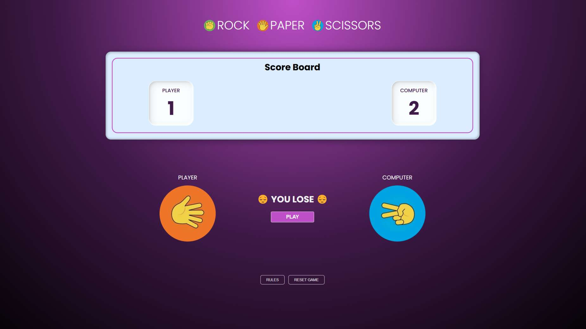

# Rock-Paper-Scissors Game



## Overview

This repository contains the code for a simple Rock-Paper-Scissors game, which is implemented using HTML, CSS, and JavaScript. Below are the key components of the repository.

## Repository Structure

- **`src/`**: A directory that contains icons and images used in the game.
- **`index.html`**: The main HTML file that serves as the entry point for the game.
- **`style.css`**: The stylesheet that defines the visual appearance of the game.
- **`script.js`**: The JavaScript file that contains the game logic and interactivity.

## Features

- User-friendly interface for playing Rock-Paper-Scissors.
- Responsive design for various screen sizes.
- Interactive gameplay with real-time results.

## Getting Started

1. Clone the repository:
   ```bash
   git clone https://github.com/CJay-Cipher/portfolio.git
